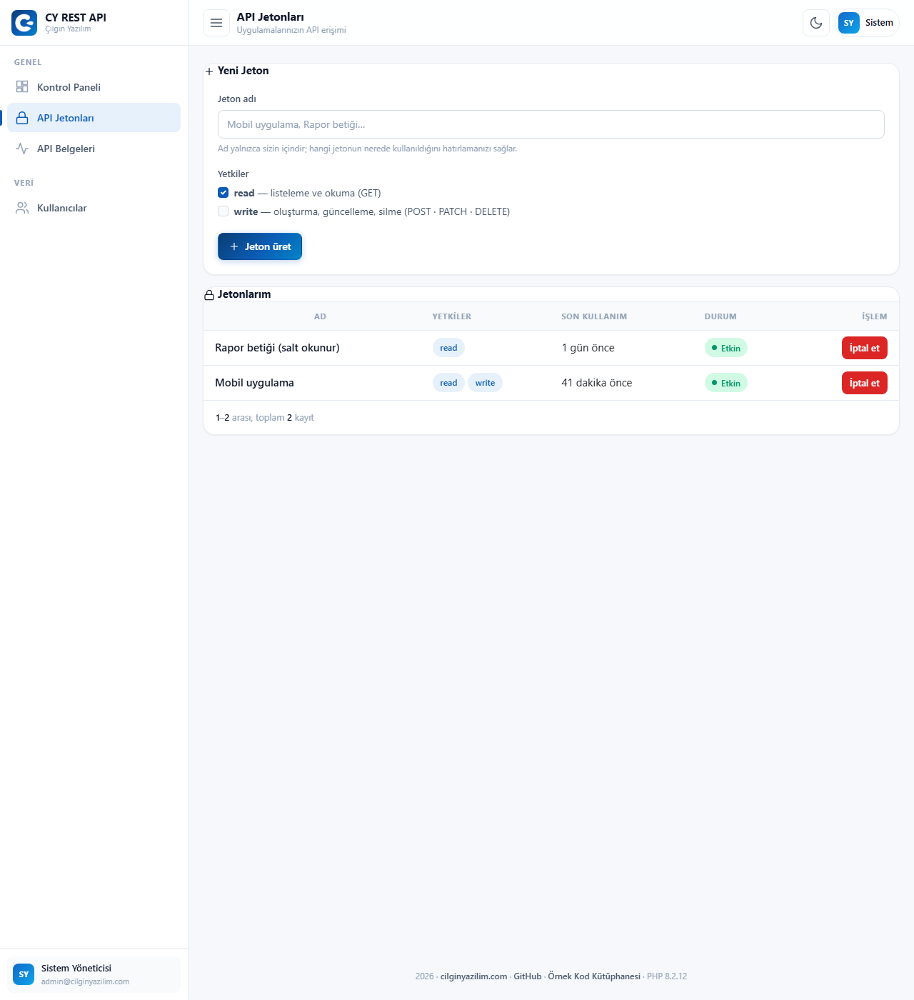
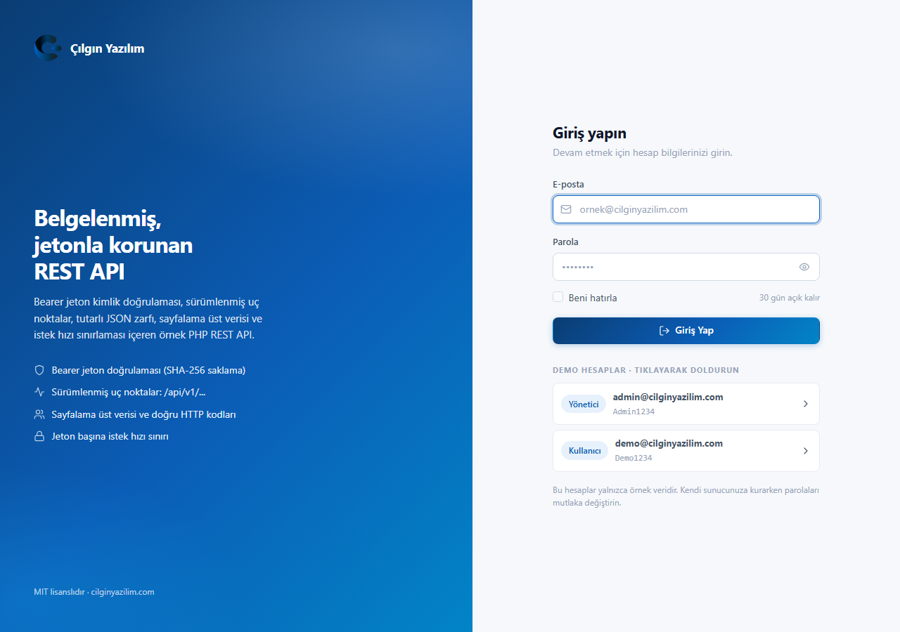
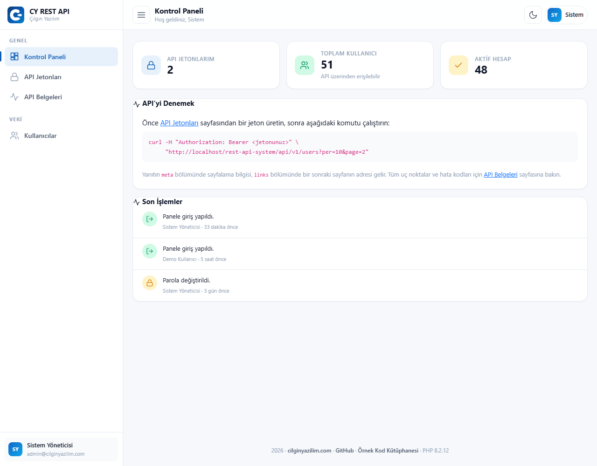
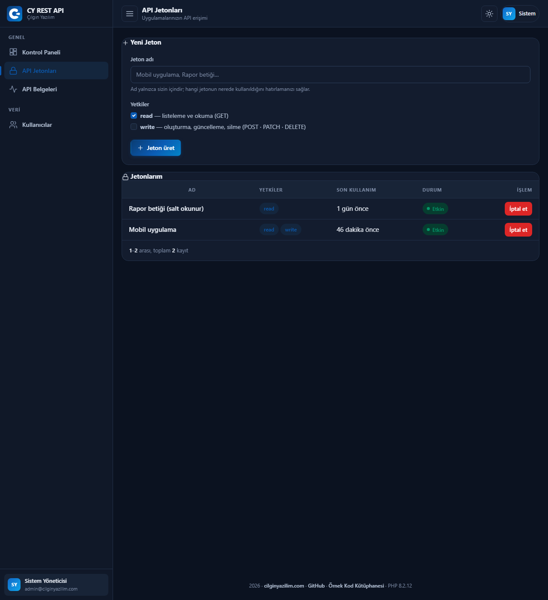
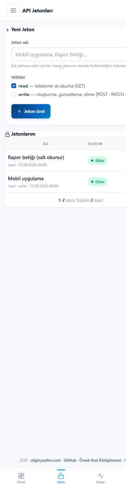

<div align="center">


# REST API System

### PHP 8 · PDO · MySQL · Token Authentication · Scopes · Rate Limiting · Pagination · Çılgın Yazılım Design Pattern

**Generate a token in the panel, pick its scope, try it with `curl`.**

[](https://php.net)
[](https://mysql.com)
[](#api-reference)
[](#installation)
[](LICENSE)

[🇹🇷 Türkçe](README.md) · **🇬🇧 English**

[**▶ Live Demo**](https://cilginyazilim.com/kutuphane/uygulama/rest-api-system/) · [Code Library](https://cilginyazilim.com/kutuphane/php-rest-api-panel) · [cilginyazilim.com](https://cilginyazilim.com)

</div>

---

<div align="center">

## Live Demo

**No setup, no sign-up, no download — try it in your browser in 3 seconds.**

<a href="https://cilginyazilim.com/kutuphane/uygulama/rest-api-system/"></a>
<a href="https://cilginyazilim.com/kutuphane/php-rest-api-panel"></a>
<a href="https://github.com/CilginYazilim/rest-api-system/archive/refs/heads/main.zip"></a>

<br><br>

<a href="https://cilginyazilim.com/kutuphane/uygulama/rest-api-system/" title="Click to open the live demo">
  
</a>

<sub>▲ Click the image to open the demo</sub>

</div>

<br>

### Demo accounts

| Role | E-mail | Password |
|---|---|---|
| Administrator | `admin@cilginyazilim.com` | `Admin1234` |
| User | `demo@cilginyazilim.com` | `Demo1234` |

### What can you try in 60 seconds?

| # | Try this | What happens behind the scenes |
|---|---|---|
| **1** | On the **API Tokens** page, press **"Generate token"** and tick `read` | The plaintext token is shown **only this once**. Only a SHA-256 digest is stored in the database; close the page and nobody can ever see it again |
| **2** | Copy the token and make a request with `curl` | `curl -H "Authorization: Bearer <token>" .../api/v1/users` — JSON comes back |
| **3** | Look at the `meta` block in the response | Total records, page, page size and total page count. The client never has to guess the pagination |
| **4** | Look at the `links` block | The **full URL** of the next page arrives ready-made. The client follows rather than builds |
| **5** | Try `?per=200` | The page size is **capped**. Otherwise a single request could pull the whole table |
| **6** | Try a **POST** with a `read`-only token | `403` and `insufficient_scope`. The scope check lives in the route's **middleware**, not in an `if` that a controller can forget |
| **7** | Look at the response headers (`curl -i`) | `X-RateLimit-Limit`, `X-RateLimit-Remaining` and `X-RateLimit-Reset` are sent. A client can slow down *before* hitting the wall |
| **8** | Make more than 60 requests with the same token | `429` and a `Retry-After` header. Counting is **per token**; nobody else's traffic can block you |
| **9** | Press **"Revoke"** on the token, then make another request | `401`. The token isn't deleted — `revoked_at` is filled in, so past request records stay linked and "what did this token do?" remains answerable |
| **10** | Open the **API Docs** page | Every endpoint, its scope, the error codes and copy-pasteable `curl` examples |
| **11** | Pick your language in the **Example Usage** section on the same page | The cURL, PHP, JavaScript and Python snippets are printed with **this server's real address**. **Download** hands you a working file; no token is written into it, only a placeholder |

> **Tip:** Errors are structured too: every error has a machine-readable `code` (`invalid_token`, `insufficient_scope`, `validation_failed`, `rate_limit_exceeded`) and a human-readable `message`.

### What to know about the demo area

| Topic | Status |
|---|---|
| **Data** | **51 users + 3 sample tokens + 28 request records** from `database.sql`. No real personal data. |
| **A ready-made token** | **There isn't one, and there never will be.** A token sitting in a repository is a token everybody who downloads it knows. Generate your own from the panel. |
| **Reset** | The demo database is **periodically restored**; the token you generate is not permanent. |
| **Rate limit** | **60 requests** per window. The sample tokens' records do **not** eat your quota; counting is per token. |
| **`APP_DEBUG`** | Automatically **`false`** in production — derived from the host name. |
| **Dependencies** | **Zero.** No Composer, no npm, no CDN. |

---

## What Is This Project?

"Let's write an API" usually produces this: an `api.php` file with `if ($_GET['action'] == 'users')` inside and `echo json_encode($rows)` at the end. It works — until these questions arrive:

- **Who made this request?** No key, no answer.
- **What is this key allowed to do?** If every client that can read can also delete, one bug in your reporting script can empty your database.
- **The key leaked — now what?** If you stored it in plaintext, a database leak is directly an account leak.
- **One client is making 300 requests a second** and everyone else is waiting.
- **I returned 10,000 records** and the response is 8 MB.

This project builds an API layer that answers all five. Tokens are generated from a panel, limited by **scope** (`read` / `write`), stored **only as a digest**, and revocable; every request passes a **per-token** rate limit, and lists are always **paginated**.

What sets it apart is that the API doesn't arrive alone — it comes **with a panel that manages it**: you don't need phpMyAdmin to generate a token, pick its scope, see its last use or revoke it.

**Who is it for?**

- Anyone opening an API to a mobile app or another service
- Anyone who wants to learn why storing keys in plaintext is dangerous, and what to do instead
- Anyone who wants to get scopes, rate limiting and pagination right
- Anyone who wants server-side revocable tokens without reaching for JWT
- Anyone looking for a reusable admin panel pattern built on Bootstrap 5

This project is one of the documented, production-ready examples published in the **[Çılgın Yazılım Code Library](https://cilginyazilim.com/kutuphane)**.

---

## Table of Contents

- [Live Demo](#live-demo)
- [What Is This Project?](#what-is-this-project)
- [Screenshots](#screenshots)
- [Quick start](#quick-start)
- [Key Decisions](#key-decisions)
- [What's Included?](#whats-included)
- [API Reference](#api-reference)
- [Error codes](#error-codes)
- [Security: What Did We Close, and How?](#security-what-did-we-close-and-how)
- [Installation](#installation)
- [Configuration](#configuration)
- [File Structure](#file-structure)
- [How Does It Work?](#how-does-it-work)
- [Database Schema](#database-schema)
- [FAQ](#faq)
- [Going to Production](#going-to-production)
- [Troubleshooting](#troubleshooting)
- [Roadmap](#roadmap)
- [Contributing](#contributing)
- [License](#license)

---

## Screenshots

| Login | Dashboard |
|---|---|
|  |  |

| API Tokens | API Docs |
|---|---|
|  |  |

<div align="center">

<br><sub>Dark theme</sub>
<br><br>

<br><sub>Mobile view at 390px</sub>
</div>

---

## Quick start

**1 · Generate a token.** Log in → **API Tokens** → "Generate token". Pick the scope (`read`, `write`, or both).

The plaintext token is shown **only at that moment**:

```
cy_9f2b7c1d5e83a04f6b91c2d7e0a5f38b4c6d9e2a1f7b30c8d5e4a9b6c3f1d827
```

**2 · Make a request.**

```bash
curl -H "Authorization: Bearer cy_9f2b..." \
     "http://localhost/rest-api-system/api/v1/users?per=10&page=2"
```

**3 · Read the response.**

```json
{
  "data": [
    { "id": 11, "name": "Fatma", "surname": "YILDIZ",
      "email": "fatma.yildiz@ornek.com", "is_active": false,
      "created_at": "2025-01-15T23:58:29+03:00" }
  ],
  "meta": {
    "total": 51,
    "per_page": 10,
    "current_page": 2,
    "last_page": 6,
    "from": 11,
    "to": 20,
    "has_more": true
  },
  "links": {
    "self": "http://localhost/rest-api-system/api/v1/users?page=2&per=10",
    "next": "http://localhost/rest-api-system/api/v1/users?page=3&per=10",
    "prev": "http://localhost/rest-api-system/api/v1/users?page=1&per=10"
  }
}
```

**4 · Look at the headers.**

```bash
curl -i -H "Authorization: Bearer cy_9f2b..." .../api/v1/users
```

```http
HTTP/1.1 200 OK
Content-Type: application/json; charset=utf-8
X-RateLimit-Limit: 60
X-RateLimit-Remaining: 57
X-RateLimit-Reset: 1757012400
```

---

## Key Decisions

### 1. Tokens are never stored in **plaintext**

An API key is a password. Store it in plaintext and a database leak becomes an account leak — and unlike a password, a token isn't rotated by the user; it stays the same for months.

```php
// app/Repositories/ApiTokenRepository.php
private static function hash(string $plain): string
{
    return hash('sha256', $plain);
}
```

Only `token_hash` lives in the table. Verification hashes the incoming token and searches **by the digest**.

**Why SHA-256 and not `password_hash()`?** They solve different problems. `password_hash()` is deliberately **slow** (bcrypt) because it protects human-chosen passwords from dictionary attacks — people pick `123456`. An API token is 32 **random** bytes; it isn't subject to dictionary attacks and needs no salt. In exchange, it is verified on *every* API request: bcrypt would add 100 ms to each one. SHA-256 is both sufficient and fast.

### 2. The scope check lives in the **route**, not the controller

```php
// routes/web.php
$router->get('api/v1/users',        UserApiController::class, 'index',  ['api', 'scope:read']);
$router->post('api/v1/users',       UserApiController::class, 'store',  ['api', 'scope:write']);
$router->delete('api/v1/users/{id}',UserApiController::class,'destroy', ['api', 'scope:write']);
```

If the scope were an `if` on the controller's first line, someone adding a new endpoint would eventually forget it — and that omission would leave a hole **silently**.

In the route table, authorisation is **part of the endpoint's definition**. One file tells you who can reach what.

### 3. Rate limiting is **per token**, not per IP

Per-IP limits are wrong in both directions: a hundred users behind one office IP share it (and get unfairly blocked), while a single attacker can rotate thousands of IPs (and is never blocked).

Counting per token ties the limit to an **identity**. Your traffic never eats someone else's quota.

```sql
SELECT COUNT(*) FROM api_requests
 WHERE token_id = :id AND requested_at >= (NOW() - INTERVAL :window SECOND)
```

Three headers are sent on every response (`X-RateLimit-Limit`, `-Remaining`, `-Reset`), so a well-behaved client can slow down **before** hitting the wall. When the limit is exceeded, `429` and `Retry-After` are returned.

Rows older than an hour are cleaned up automatically; the table doesn't grow forever.

### 4. A revoked token is **not deleted**

```php
UPDATE api_tokens SET revoked_at = NOW() WHERE id = :id
```

Deleting the row would take its `api_requests` records with it (`ON DELETE CASCADE`), and "which token did what last month?" would become unanswerable. After a security incident, that is exactly the question you want to ask.

Verification requires `revoked_at IS NULL`; a revoked token is invalid immediately.

### 5. Page size is capped

```php
public const PER_PAGE_OPTIONS = [10, 20, 50, 100];
public const DEFAULT_PER_PAGE = 20;
```

A client writing `?per=100000` — usually carelessly rather than maliciously — asks for the whole table in one request. That blows up both server memory and response size.

The cap is a security control; it isn't left to the client's good intentions.

### 6. The response envelope: `data` + `meta` + `links`

Returning a bare array (`[{...},{...}]`) leaves nowhere to put pagination information, and adding it later would be a **breaking change**.

`data` carries the content, `meta` the counts, `links` the navigation. The client doesn't construct the next page's URL, it follows `links.next` — so even if you change the pagination style later, existing clients keep working.

### 7. Errors have a machine-readable code too

```json
{
  "error": {
    "code": "insufficient_scope",
    "message": "The 'write' scope is required for this operation.",
    "details": { "required_scope": "write", "granted": ["read"] }
  }
}
```

Clients should never compare the `message` string — it changes with language and version. `code` is stable and can be handled programmatically.

### 8. Header order matters when sending `WWW-Authenticate`

When PHP sees a `WWW-Authenticate` header, it automatically switches the status code to `401`. If you send that header first somewhere you meant to return `403`, the response silently becomes `401`.

That's why `http_response_code()` is called **after** the headers. (The same behaviour applies to `Location:`, where the code silently becomes `302`.)

---

## What's Included?

<table>
<tr><td valign="top" width="50%">

**API layer**

- Bearer token authentication
- Scopes: `read` / `write`, at route level
- Per-token rate limiting + three informational headers
- Pagination: `meta` + `links`, capped `per`
- Consistent error envelope (`code` · `message` · `details`)
- Correct HTTP codes: 200 · 201 · 204 · 400 · 401 · 403 · 404 · 405 · 422 · 429
- A `Location` header alongside `201`
- ISO-8601 dates, with timezone information

</td><td valign="top" width="50%">

**Panel**

- Token generation with scope selection
- The plaintext is shown **only once**
- Last-used timestamp and IP
- Revocation (without deletion)
- API documentation page with copy-pasteable `curl` examples
- **Example Usage**: cURL, PHP, JavaScript, Python
- Downloadable example file (placeholder instead of a token)

**Shared infrastructure**

- Session login, "remember me", rate limiting, CSRF
- CSP (`script-src 'self'`), `X-Frame-Options: DENY`
- Light / dark theme, stored on the account
- Bottom navigation on mobile, no horizontal scrolling
- Zero dependencies

</td></tr>
</table>

---

## API Reference

Every endpoint requires an `Authorization: Bearer <token>` header.

<details>
<summary><b>GET /api/v1/users</b> — list users · scope: <code>read</code></summary>

**Query parameters**

| Name | Type | Default | Description |
|---|---|---|---|
| `page` | int | `1` | Page number |
| `per` | int | `20` | Page size — **capped** by `10, 20, 50, 100` |

**Example**

```bash
curl -H "Authorization: Bearer cy_..." \
     "http://localhost/rest-api-system/api/v1/users?page=2&per=10"
```

**Response · 200**

```json
{
  "data": [ { "id": 11, "name": "Fatma", "surname": "YILDIZ",
              "email": "fatma.yildiz@ornek.com", "is_active": false,
              "created_at": "2025-01-15T23:58:29+03:00" } ],
  "meta":  { "total": 51, "per_page": 10, "current_page": 2, "last_page": 6, "from": 11, "to": 20, "has_more": true },
  "links": { "self": "...page=2&per=10",
             "next": "...page=3&per=10",
             "prev": "...page=1&per=10" }
}
```

</details>

<details>
<summary><b>GET /api/v1/users/{id}</b> — a single user · scope: <code>read</code></summary>

```bash
curl -H "Authorization: Bearer cy_..." \
     "http://localhost/rest-api-system/api/v1/users/11"
```

**Response · 200**

```json
{ "data": { "id": 11, "name": "Fatma", "surname": "YILDIZ",
            "email": "fatma.yildiz@ornek.com", "is_active": false,
            "created_at": "2025-01-15T23:58:29+03:00" } }
```

If not found, **404** with the `not_found` code.

</details>

<details>
<summary><b>POST /api/v1/users</b> — create a user · scope: <code>write</code></summary>

```bash
curl -X POST \
     -H "Authorization: Bearer cy_..." \
     -H "Content-Type: application/json" \
     -d '{"name":"Ayse","surname":"Yilmaz","email":"ayse@ornek.com","password":"Gizli1234"}' \
     "http://localhost/rest-api-system/api/v1/users"
```

**Response · 201** — the `Location` header carries the new record's URL.

```json
{ "data": { "id": 52, "name": "Ayse", "surname": "Yilmaz",
            "email": "ayse@ornek.com", "is_active": true,
            "created_at": "2026-09-03T04:12:00+03:00" } }
```

**Validation error · 422**

```json
{
  "error": {
    "code": "validation_failed",
    "message": "The submitted data is invalid.",
    "details": {
      "email": ["This e-mail is already registered."],
      "password": ["Must be at least 8 characters."]
    }
  }
}
```

Errors are **per field**: the client knows which input to highlight.

</details>

<details>
<summary><b>PATCH /api/v1/users/{id}</b> — update a user · scope: <code>write</code></summary>

Only the fields you send are changed (partial update).

```bash
curl -X PATCH \
     -H "Authorization: Bearer cy_..." \
     -H "Content-Type: application/json" \
     -d '{"is_active":false}' \
     "http://localhost/rest-api-system/api/v1/users/11"
```

**Response · 200** — the full updated record is returned.

</details>

<details>
<summary><b>DELETE /api/v1/users/{id}</b> — delete a user · scope: <code>write</code></summary>

```bash
curl -X DELETE -H "Authorization: Bearer cy_..." \
     "http://localhost/rest-api-system/api/v1/users/52"
```

**Response · 204** — no body. Since there is no record left to return after a delete, `204 No Content` is the correct code.

</details>

---

## Error codes

| HTTP | `code` | When |
|---|---|---|
| 400 | `invalid_json` | The body could not be parsed as JSON |
| 401 | `unauthenticated` | The `Authorization` header is missing or malformed |
| 401 | `invalid_token` | Token not found, revoked, or the account is inactive |
| 403 | `insufficient_scope` | The token lacks the scope for this operation |
| 403 | `self_delete` | You cannot delete your own account through the API |
| 404 | `not_found` | No such record or endpoint |
| 405 | `method_not_allowed` | The URL exists but this HTTP method isn't defined |
| 409 | `email_taken` | This e-mail belongs to another account |
| 422 | `validation_failed` | Per-field validation error (inside `details`) |
| 422 | `nothing_to_update` | The PATCH body contains no updatable field |
| 429 | `rate_limit_exceeded` | Rate limit exceeded (with a `Retry-After` header) |
| 500 | `server_error` | Unexpected error — details are **never sent to the client**, they go to the log |

---

## Security: What Did We Close, and How?

| Vulnerability | Typical broken code | In this project |
|---|---|---|
| **Token leakage** | Storing the token in plaintext | Only the **SHA-256 digest** is stored; the plaintext is shown once |
| **Privilege escalation** | One key that can do everything | **Scopes** (`read`/`write`), enforced at route level |
| **Unrevocable keys** | Long-lived JWTs | The token lives on the server; `revoked_at` invalidates it **instantly** |
| **Timing attacks** | `if ($hash == $incoming)` | Lookup happens by digest; equality comparisons use `hash_equals()` |
| **SQL injection** | `"... WHERE id = $id"` | All queries are prepared statements; `ATTR_EMULATE_PREPARES = false` |
| **Excessive data extraction** | `?per=100000` | The page size is **capped** |
| **Resource exhaustion** | Unlimited requests | Per-token rate limiting + `429` + `Retry-After` |
| **Error leakage** | Dumping the exception message into JSON | The `500` response carries no details; they go to the log |
| **Wrong status code** | Trying `403` after `WWW-Authenticate` | `http_response_code()` is called **after** the headers |
| **Hard-coded path breakage** | `RewriteBase /api` in `.htaccess` | No hard-coded path; Apache derives the base from the directory |
| **User enumeration** | "No such e-mail" | The **same** message and the **same** timing for both wrong e-mail and wrong password at login |
| **Silent JSON loss on broken UTF-8** | `json_encode($v)` | `JSON_INVALID_UTF8_SUBSTITUTE` |

---

## Installation

### Requirements

| | |
|---|---|
| PHP | 8.0 or newer |
| MySQL / MariaDB | 5.7+ / 10.3+ |
| Web server | Apache (`mod_rewrite`) or Nginx |
| PHP extensions | `pdo_mysql`, `mbstring` |

### Steps

```bash
git clone https://github.com/CilginYazilim/rest-api-system.git
cd rest-api-system

mysql -u root -p < database.sql
cp .env.example .env        # Windows: copy .env.example .env
```

Open `http://localhost/rest-api-system/` · Log in with `admin@cilginyazilim.com` / `Admin1234`

Then generate your own token from the **API Tokens** page.

> **Apache may drop the `Authorization` header.** In CGI/FastCGI mode Apache withholds it from PHP for security reasons; the result is that every request returns `401` even with a correct token. The project's `.htaccess` solves this by copying the header into an environment variable:

```apache
RewriteCond %{HTTP:Authorization} .
RewriteRule .* - [E=HTTP_AUTHORIZATION:%{HTTP:Authorization}]
```

PHP then sees it as `$_SERVER['HTTP_AUTHORIZATION']`. On Nginx + PHP-FPM the equivalent is:

```nginx
fastcgi_param HTTP_AUTHORIZATION $http_authorization;
```

---

## Configuration

```env
APP_DEBUG=true          # delete this line: on locally, off in production
APP_URL=
APP_PRETTY_URLS=true

DB_HOST=127.0.0.1
DB_PORT=3306
DB_NAME=cy_rest_api
DB_USER=root
DB_PASS=
```

The values that shape API behaviour live in code:

| Value | Location | Default | What it does |
|---|---|---|---|
| rate limit | `ApiRateLimiter::__construct` | `60` | Requests allowed per window |
| window | `ApiRateLimiter::__construct` | `60` s | The counting window |
| page size | `Paginator::DEFAULT_PER_PAGE` | `20` | When `per` isn't given |
| cap | `Paginator::PER_PAGE_OPTIONS` | `100` | The largest allowed `per` |
| scopes | `ApiToken::SCOPES` | `read`, `write` | The defined scope list |

---

## File Structure

```
rest-api-system/
│
├── index.php                      Front controller — the SINGLE entry point
├── database.sql                   Schema + 51 users + 3 tokens + request records
├── .env.example
│
├── app/
│   ├── Core/
│   │   ├── ApiAuth.php            ★ Bearer verification · requireScope()
│   │   ├── ApiRateLimiter.php     ★ Per-token counting · X-RateLimit-* headers
│   │   ├── ApiResponse.php        ★ data/meta/links envelope · error envelope · HTTP codes
│   │   ├── Paginator.php          Pagination and capping
│   │   ├── Middleware.php         The 'api' and 'scope:read|write' middlewares
│   │   ├── Auth.php · Session.php · Csrf.php · RateLimiter.php
│   │   ├── Database.php           PDO (EMULATE_PREPARES = false)
│   │   ├── Env.php                .env reader + isLocalHost()
│   │   └── ...
│   │
│   ├── Http/Controllers/
│   │   ├── Api/V1/UserApiController.php   ★ index · show · store · update · destroy
│   │   ├── Api/PreferenceApiController.php
│   │   ├── TokenController.php    Generate / revoke tokens
│   │   ├── ApiDocController.php   The API documentation page
│   │   └── Auth · Dashboard · User
│   │
│   ├── Models/ApiToken.php        SCOPE_READ · SCOPE_WRITE
│   ├── Repositories/ApiTokenRepository.php  ★ create() · findByPlain() · revoke()
│   └── Support/helpers.php
│
├── views/                         Layouts, token and documentation pages
├── assets/                        css · js · images
├── config/config.php
│   ├── Support/ApiExamples.php    ★ Builds the example usage snippets
├── routes/web.php                 ★ Scopes are declared here
└── docs/                          index.html · screenshots/
```

---

## How Does It Work?

```
Client
   │  GET /api/v1/users?per=10&page=2
   │  Authorization: Bearer cy_9f2b...
   ▼
index.php  →  Router::dispatch()
   │
   ▼
Route matched: ['api', 'scope:read']
   │
   ├──────────── MIDDLEWARE: api ─────────────────────────────┐
   │  ApiAuth::authenticate()                                 │
   │    1. Authorization header present? no → 401             │
   │    2. hash('sha256', $token)                             │
   │    3. SELECT ... WHERE token_hash = ? AND revoked_at IS NULL
   │       not found / account inactive → 401 invalid_token   │
   │    4. last_used_at and last_used_ip are updated          │
   │                                                          │
   │  ApiRateLimiter::check($tokenId, $ip)                    │
   │    SELECT COUNT(*) FROM api_requests                     │
   │     WHERE token_id = ? AND requested_at >= NOW()-60s     │
   │       count >= 60 → 429 + Retry-After                    │
   │    INSERT INTO api_requests (...)                        │
   │    X-RateLimit-Limit / -Remaining / -Reset headers       │
   └──────────────────────────────────────────────────────────┘
   │
   ├──────────── MIDDLEWARE: scope:read ──────────────────────┐
   │  ApiAuth::requireScope('read')                           │
   │    not among the token's scopes → 403                    │
   │      insufficient_scope + details{required, granted}     │
   └──────────────────────────────────────────────────────────┘
   │
   ▼
UserApiController::index()
   │   Paginator: per is capped (100 max)
   │   UserRepository::page($offset, $limit)
   ▼
ApiResponse::collection($items, $paginator, 'api/v1/users')
   │
   ▼
{ "data": [...], "meta": {...}, "links": {...} }
   json_encode(..., JSON_INVALID_UTF8_SUBSTITUTE)
```

---

## Database Schema

### `api_tokens`

| Column | Type | Purpose |
|---|---|---|
| `id` | INT UNSIGNED | Primary key |
| `user_id` | INT UNSIGNED | Whose behalf the token acts on (`ON DELETE CASCADE`) |
| `name` | VARCHAR(100) | A descriptive name like "Mobile app" |
| `token_hash` | CHAR(64) | The **SHA-256 digest** — the plaintext is stored nowhere |
| `scopes` | VARCHAR(100) | Comma-separated scopes (`read,write`) |
| `last_used_at` · `last_used_ip` | DATETIME · VARCHAR(45) | Last use — the easiest way to spot suspicious activity |
| `revoked_at` | DATETIME | If set, the token is invalid; the row is **not deleted** |
| `created_at` | DATETIME | When it was generated |

### `api_requests` — the rate-limit window

| Column | Type | Purpose |
|---|---|---|
| `id` | BIGINT UNSIGNED | Primary key |
| `token_id` | INT UNSIGNED | Which token (`ON DELETE CASCADE`) |
| `ip` | VARCHAR(45) | The requesting address (45 chars for IPv6) |
| `requested_at` | DATETIME | Request time (indexed) |

| Decision | Why |
|---|---|
| Counting **per token** | Per-IP counting unfairly blocks a hundred users in one office and never blocks an attacker rotating IPs |
| Rows older than an hour are deleted | The table is a rate-limit window, not an archive; it must not grow forever |
| `revoked_at` instead of deleting the row | Deleting would take the token's request records with it — exactly what you need during an incident review |
| `scopes` as a text column, not a join table | There are two scopes; a relation table would cost an extra `JOIN` on every request |
| `token_hash` as `CHAR(64)` | A SHA-256 digest is always 64 hex characters; fixed length is both smaller and faster |

---

## FAQ

<details>
<summary><b>Why didn't you use JWT?</b></summary>

JWT's main benefit is being **stateless**: the server doesn't store the token, it verifies the signature and moves on. That is very valuable in architectures spread across many services.

But that same property creates its biggest drawback: **it can't be revoked**. A leaked JWT is valid until it expires. To fix that you keep a revocation list — and at that moment you've lost statelessness.

In a single application, storing the token in the database costs one indexed query; in return you get **instant revocation**, scope management and last-use information. That trade-off makes sense here.

If you want a JWT example, see [REST API with JWT](https://cilginyazilim.com/kutuphane/php-rest-api-jwt) in the library.
</details>

<details>
<summary><b>I lost my token — where can I see it?</b></summary>

You can't, and that's deliberate. Only a digest is stored, and a digest cannot be reversed.

Generate a new token and revoke the old one. This is the correct behaviour in any system where "I forgot my token" is indistinguishable from a leak.
</details>

<details>
<summary><b>Every request returns `401` but the token is correct</b></summary>

Almost always the `Authorization` header isn't reaching PHP. Some Apache configurations drop it.

The project's `.htaccess` copies the header into an environment variable using `RewriteRule ... [E=HTTP_AUTHORIZATION:...]`. Make sure the file is actually read on your server (`AllowOverride All`). For Nginx + PHP-FPM:

```nginx
fastcgi_param HTTP_AUTHORIZATION $http_authorization;
```

To confirm, temporarily print it: `var_dump($_SERVER['HTTP_AUTHORIZATION'] ?? 'MISSING');`
</details>

<details>
<summary><b>How do I change the rate limit?</b></summary>

Change the two values in the `ApiRateLimiter` constructor: `$limit` (request count) and `$window` (seconds).

To give different tokens different limits, add a `rate_limit` column to `api_tokens` and pass that value into the limiter — nothing else changes.
</details>

<details>
<summary><b>How do I add a new endpoint?</b></summary>

Two steps:

1. Write the method on a controller (`app/Http/Controllers/Api/V1/`).
2. Declare the route **with its scope**:

```php
$router->get('api/v1/orders', OrderApiController::class, 'index', ['api', 'scope:read']);
```

If you forget the scope, the endpoint requires a token but **checks no scope**. That stands out when reviewing the route table — which is exactly why the scope lives in the route rather than hidden inside a controller.

**Careful:** static paths (`api/v1/users`) must be declared **before** patterned ones (`api/v1/users/{id}`).
</details>

<details>
<summary><b>How do I bump the API version?</b></summary>

Add `api/v2/...` routes and put the controllers under `Api/V2/`. `v1` keeps working.

That's why the version lives in the URL: clients migrate at their own pace. Announce the date you'll retire `v1` in advance, and use `api_tokens.last_used_at` to see who is still on the old version.
</details>

---

## Going to Production

- [ ] Set `APP_DEBUG=false` in `.env` (or delete the line)
- [ ] **Enforce HTTPS** — a Bearer token travels in the clear over plain HTTP
- [ ] Tune the rate limit to your traffic
- [ ] Verify the `Authorization` header reaches PHP
- [ ] Revoke or delete the demo tokens
- [ ] Verify the `api_requests` table is being cleaned (a one-hour window)
- [ ] Create a **non-root** database user
- [ ] Are the `.htaccess` files in `config/`, `app/`, `routes/` and `views/` in place?
- [ ] Change the demo account passwords, or delete the accounts

---

## Troubleshooting

| Symptom | Cause | Fix |
|---|---|---|
| Every request returns `401` | The `Authorization` header isn't reaching PHP | `RewriteRule ... [E=HTTP_AUTHORIZATION:...]` / `fastcgi_param HTTP_AUTHORIZATION` |
| `403 insufficient_scope` | The token's scope isn't enough | Generate a new token with the `write` scope |
| Constant `429` | The rate limit is exceeded | Wait out `Retry-After` or raise the limit |
| `404` — the endpoint exists but isn't found | A patterned route was declared before a static one | Fix the order in `routes/web.php` |
| `405 method_not_allowed` | The URL is right, the method isn't defined | Check the route table for that method |
| Dates arrive without a time | Timezone setting | `config/config.php` → `app.timezone` |
| Broken Turkish characters | Connection charset | Verify `charset=utf8mb4` in `Database.php` |
| Every URL returns 404 | `mod_rewrite` is off | Enable it, or set `APP_PRETTY_URLS=false` |

---

## Roadmap

- [ ] Per-token configurable rate limits
- [ ] Token expiry dates (`expires_at`)
- [ ] Conditional requests with `If-None-Match` / `ETag`
- [ ] Outgoing (signed) webhooks
- [ ] OpenAPI (Swagger) definition generation

---

## Contributing

Open an [issue](https://github.com/CilginYazilim/rest-api-system/issues) for bug reports and suggestions.

## License

[MIT](LICENSE) — free to use in commercial projects too.

---

<div align="center">

**[Çılgın Yazılım](https://cilginyazilim.com)** · [Code Library](https://cilginyazilim.com/kutuphane) · [All Examples](https://github.com/CilginYazilim)

</div>
